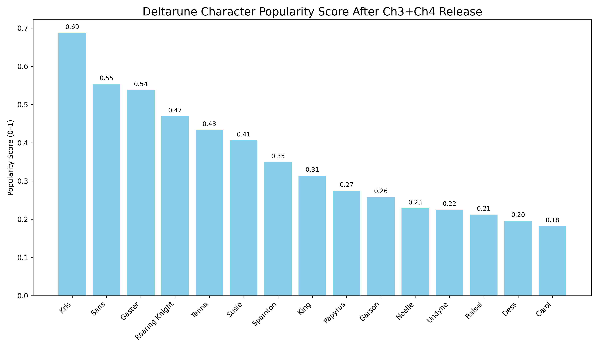

# Day 1 – Deltarune Character Popularity

This project analyzes character popularity in the Deltarune/Undertale universe using real-world data from:

- Reddit discussions
- Google Trends search volume
- YouTube video titles & views

The result: a normalized, weighted popularity score for each character.

---

## Data Sources

| Source     | Metric                     |
|------------|----------------------------|
| Reddit     | Character mentions in ~2.1K top posts this week |
| Google     | Search trends (avg score 0–100) |
| YouTube    | Views from recent videos mentioning each character |

---

## Final Output



- Results normalized 0–1
- Weighted score = Reddit (40%) + Google Trends (30%) + YouTube (30%)

---

## Environment Setup

APIs are stored in a `.env` file (not included in repo).  
You can create one like this:

```env
REDDIT_CLIENT_ID=your_id
REDDIT_CLIENT_SECRET=your_secret
REDDIT_USER_AGENT=some_user_agent

YOUTUBE_API_KEY=your_youtube_api_key
