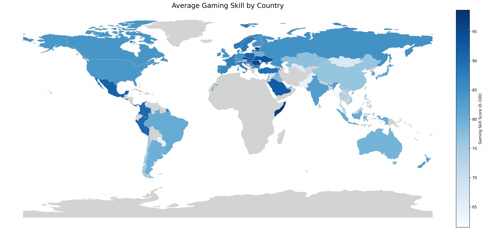

# Day 2 – Global Gaming Skill Index

This project visualizes competitive gaming skill levels by country using real leaderboard and performance data from multiple games. Each country is scored on a 0–100 scale and shaded accordingly on a world map.

---

## Data Sources

| Game        | Metric                        |
|-------------|-------------------------------|
| Chess.com   | Country leaderboard ratings   |
| osu!        | Performance Points (PP) of top players |
| LoL         | Regional ranks → country mapped |
| CS:GO (Faceit) | ELO of top players by country |

---

## Final Output



- 192 UN countries included
- Scores normalized per game (0–100), then averaged
- Countries with no data are shown in gray
- Darker = more skilled overall

---

## Environment Setup

API keys are stored in a `.env` file (not included in repo).  
You can create one like this:

```env
FACEIT_API_KEY=your_faceit_api_key
