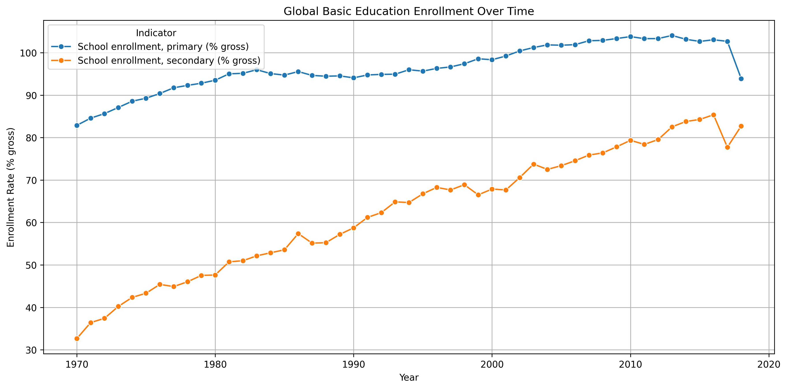
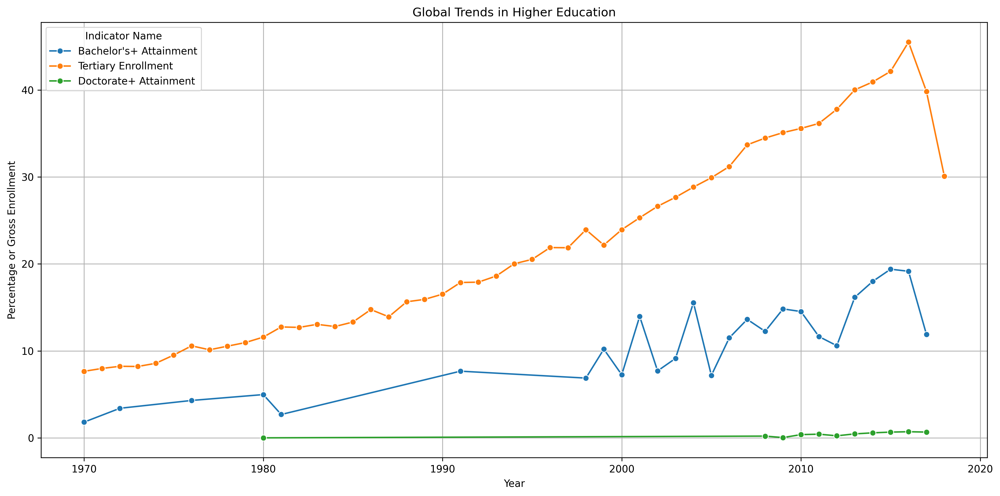
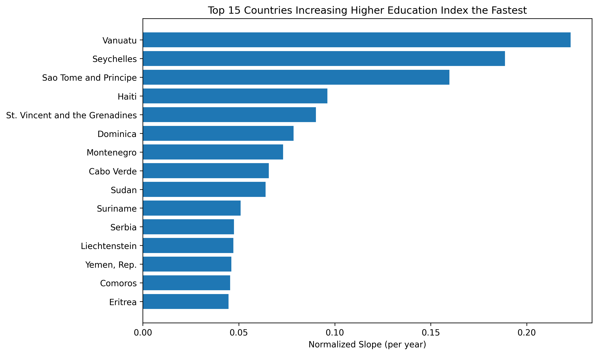
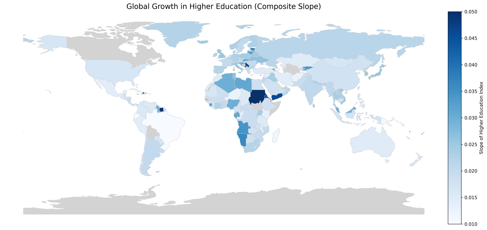

# Day 3 – Global Education Trends

This project analyzes international education data using the World Bank’s World Development Indicators. We track trends in both basic (primary/secondary) and higher education (tertiary), calculate a composite growth index, and visualize the results across time and geography.

---

## Data Sources

| Indicator Code         | Meaning                                          |
|------------------------|--------------------------------------------------|
| SE.PRM.ENRR            | Primary school enrollment (% gross)             |
| SE.SEC.ENRR            | Secondary school enrollment (% gross)           |
| SE.TER.ENRR            | Tertiary enrollment (% gross)                   |
| SE.TER.CUAT.BA.ZS      | Bachelor's degree or higher (% population 25+)  |
| SE.TER.CUAT.DO.ZS      | Doctorate or equivalent (% population 25+)      |

- Data file: `wdi-csv-zip-57-mb-`
- Visualized using GeoPandas + Matplotlib + Scikit-learn

---

## Final Output

### Global trends in basic education (primary + secondary)

---

### Composite higher ed enrollment/attainment index over time

---

### Top 15 countries increasing tertiary attainment the fastest (slope)

---

### World map showing country-level growth in higher education index

---

## Environment Setup

No API keys needed.  
All data is processed locally from World Bank WDI `.csv`.
