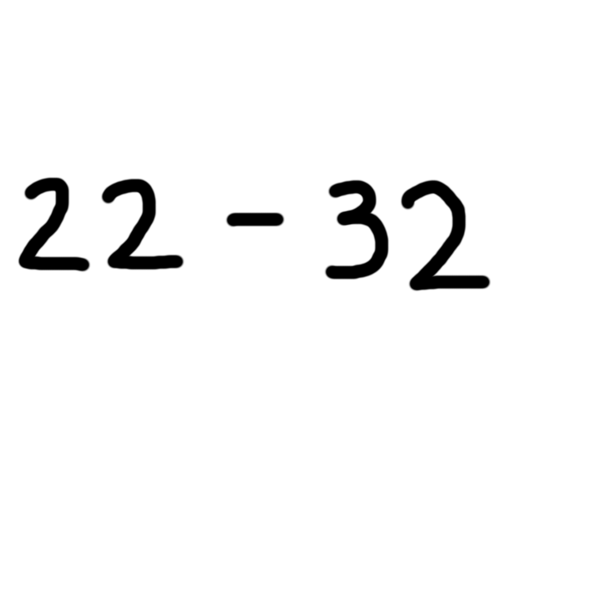

# Day 4 — Handwritten Expression Solver

A computer vision pipeline that solves simple handwritten math expressions using two custom CNN classifiers — one for digits and one for operators.

## What It Does

- Segments a handwritten expression image into individual symbols
- Classifies digits (0–9) using a model trained on MNIST
- Classifies operators (+, —, •, /) using a custom dataset
- Assembles and evaluates the expression (e.g. `2•3+4` → `10`)
- Shows debug previews of each symbol before prediction

---

## Directory Overview

- `expression_solver.py`  
  → Main script that detects and solves the handwritten expression

- `predict_digit.py`  
  → Loads and runs predictions using the MNIST-trained digit model

- `predict_operator.py`  
  → Loads and runs predictions using the custom operator classifier

- `train_model.py`  
  → Trains a CNN on MNIST digits (0–9) and saves `digit_model.h5`

- `train_operator_model.py`  
  → Trains a CNN on 4 operator classes from custom data and saves `operator_model.h5`

- `generate_operators.py`  
  → Helper to generate synthetic training images for + — • /

---

## Example Expressions

Here are three examples the model can solve:

### Example 1 – Simple Addition


```bash
python expression_solver.py sample_expressions/test1.png
```

```
Detected: 2 + 8
Expression: 2+8
Result: 10
```

---

### Example 2 – Full Expression with All Operators


```bash
python expression_solver.py sample_expressions/test3.png
```

```
Detected: 2 — 1 + 4 • 2 / 1
Expression: 2-1+4*2/1
Result: 9.0
```

---

### Example 3 – Two-digit Numbers


```bash
python expression_solver.py sample_expressions/test5.png
```

```
Detected: 22 — 32
Expression: 22-32
Result: -10
```


Each symbol is visualized and processed before solving.

---

## Notes

- Uses '•' for multiplication and '—' for subtraction to avoid conflicts with common symbols
- Operators trained on synthetic custom dataset (`operator_dataset/`)
